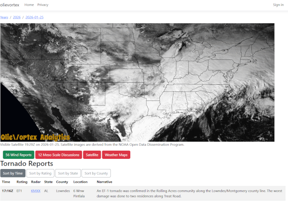

# olieblind

A full-stack weather accessibility platform that generates narrated videos containing AI-narrated weather products and visualizations. The project demonstrates expertise in designing scalable APIs, implementing sophisticated backend processing workflows, integrating external data sources, and leveraging cloud services for production infrastructure.

**Production Website**: [www.olievortex.com](https://www.olievortex.com)

## Features & Functionality

**Problem Solved**: Provides weather information and severe weather alerts to visually impaired users, removing barriers to accessing critical safety information that is typically visual-only.

**Core Capabilities**:
- **Narrated Storm Briefings** - Automatically generates audio-narrated videos from Storm Prediction Center (SPC) raw text and imagery, delivering professional weather analysis in an accessible format
- **Accessible Weather Maps** - Produces weather visualizations optimized for colorblind users, ensuring weather patterns and hazards are distinguishable to users with color vision deficiency
- **Severe Weather Archive** - Maintains a searchable historical archive of significant weather events with comprehensive descriptions and satellite imagery, enabling users to research past conditions and trends

## Technical Highlights

- Utilizes Google's text-to-speech API to narrate Storm Prediction Center storm outlooks.
- Backend process that combines C#, Python, and ffmpeg in one worksteram to generate videos and weather maps.
- Utilizes Azure Service Bus to queue time consuming processes that hydrate satellite imagery.
- Places a permenant copy of all ingested data into a Azure Blob container, following the medalian architecture (bronze-silver-gold).
- Create REST API to support the main website.
- Integrate websites and console applications with Application Insights to capure all telemetry.
- Greater than 80% code coverage
- Utilize Akamai Cloud to host MySql databases and Linode Compute instances.

## Installation

For deployment and setup instructions:
1. See [infrastructure/README.md](infrastructure/README.md)
2. See [install/README.md](install/README.md)
