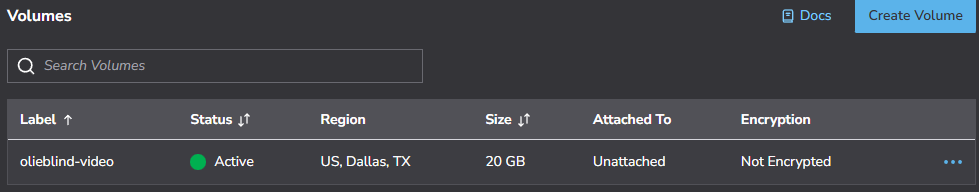

# Akamai Volume
These steps create the Akamai Volume we will attach to our virtual machine. Videos and other content are stored here. If a Linode goes corrupt, the volume should still be safe.

1. Log into Akamai Cloud
2. Navigate to Storage -> Volumes
3. Click "Create Volume"
4. Label: olieblind-video
5. Region: US, Dalls, TX (us-central)
6. Linode: Leave blank
7. Size: 20GB
8. Encrypt Volume: unchecked
9. Click "Create Volume"
10. We will initialize the volume in the AkamaiLinode instructions

