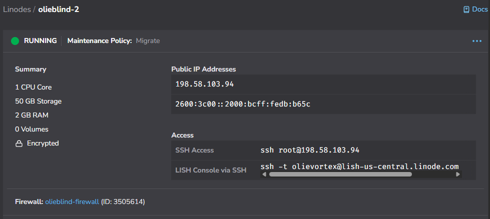

# Akamai Linode
We provision a virtual machine and configure it so we can install our software on it.

## Create the Linode
In the Linode portal, add a new Linode as follows:

- Region: US, Dallas, TX (us-central)
- Choose an OS: Fedora 43
- Linode Plan: Shared CPU -> Linode 2 GB
- Linode Label: olieblind-2
- Root Password: make it a good one. Don't forget it!
- SSH Keys: Select or Add An SSH Key. This is required! We will be disabling password auth. [Manage SSH keys](https://techdocs.akamai.com/cloud-computing/docs/manage-ssh-keys)  - [PuTTYgen](https://www.linode.com/docs/guides/use-public-key-authentication-with-ssh/)
- Disk encryption: checked
- VPC: None
- Assign Firewall: olieblind-firewall
- Add-ons: None (backups are unreliable)
- Click "Create Linode"

## Update DNS
Now that we have our IPv4 and IPv6 addresses, let's configure DNS. In the Azure Portal, navigate to your DNS Zone.

- Add A, AAAA records for olieblind-2
- Add A, AAAA records for www
- Add A, AAAA records for @

## Akamia Database Whitelist
Add the IPv6 address to the olieblind-db access list

- On the Networking tab, click "Manage Access".
- On the drawer, click "Add Another IP".
- Paste in the IPv6 address and click "Update Access Controls".

The GUI updates immediately, but the back-end can take up to 5 mintues for the changes to take effect.

## PuTTY profile
We create the olieblind-2 PuTTY profile.

- Open PuTTY
- Host Name: olieblind-2.olievortex.com
- Window -> Columns, Rows: 120, 50
- Window -> Lines of scrollback: 9999
- Connection -> SSH -> Auth -> Credentials -> Private key...: olieblind/olieblind.ppk (point this to the appropriate file created by PuTTYgen).
- Session -> Saved Sessions: olieblind-2
- Save

### Create olievortex user, disable root access
Create the olievortex account and prevent root login.

Make a PuTTY connection using the **root** account. It should accept your ssh key without asking for a password. If it asks for a password, the keys are likely not set up correctly in PuTTY.

Run these commands to create a new user called 'olievortex'.

    # adduser olievortex
    # passwd olievortex
    # usermod -aG wheel olievortex
    # cd
    # cp -R .ssh ~olievortex
    # cd ~olievortex
    # chown -R olievortex:olievortex .ssh
    # exit

Create a new PuTTY connection, this time using the **olievortex** user, not **root**.

Now, let's disable root access.

    # cd /etc/ssh
    # sudo vi sshd_config

Change the following settings in sshd_config:

    PermitRootLogin no
    PasswordAuthentication no

Restart sshd for the changes to take effect

    # sudo systemctl restart sshd

In a new PuTTY session, cfonfirm you can no longer lig in as **root**.

### Set hostname

    # sudo hostnamectl set-hostname olieblind-2

### Mount video storage
Let's attach the olieblind-video volume to olieblind-2.

- In the Akamai porta, navigate to the Linode
- Navigate to the Storage tab
- Click "Add Volume"
- Select "Attach Existing Volume"
- Select "olieblind-video" for the volume.
- Click "Attach Volume"

Soon we will get a confirmation that the volume has been attached. Now, return to our PuTTY terminal.

#### WARNING: Only perform the next step if the volume has not been formatted yet. This will erase all data!

    # !!STOP!!!
    #
    # READ THE WARNING!
    #
    # sudo mkfs.ext4 "/dev/disk/by-id/scsi-0Linode_Volume_olieblind-video"

Hopefully you heeded the warning and didn't lose all your data. Now, lets mount the volume.

    # sudo mkdir "/mnt/olieblind-video"
    # sudo mount "/dev/disk/by-id/scsi-0Linode_Volume_olieblind-video" "/mnt/olieblind-video"
    # sudo vi /etc/fstab

Add the following line to the file and save it:

    /dev/disk/by-id/scsi-0Linode_Volume_olieblind-video /mnt/olieblind-video ext4 defaults,noatime,nofail 0 2

Finally, allow the system to update it's configs.

    sudo systemctl daemon-reload

### Install packages

    # sudo yum update
    # sudo yum install git uv dotnet-sdk-10.0 ffmpeg-free httpd snapd nodejs-npm mod_ssl tar cronie net-tools mysql

### Firewall Configuration

    # sudo firewall-cmd --permanent --add-service=http
    # sudo firewall-cmd --permanent --add-service https
    # sudo firewall-cmd --reload

### Clone project for configuration settings

    # mkdir -p ~/source/repos
    # cd ~/source/repos
    # git clone https://github.com/olievortex/olieblind.git

### Configure port 80 for certbot

    # cd /var/www/html
    # echo '<html><body>
This is olieblind-2
</body></html>' | sudo tee index.html
    # sudo cp ~/source/repos/olieblind/infrastructure/5_AkamaiLinode/000-olieblind-2-default.conf /etc/httpd/conf.d

### Enable Apache

    # sudo systemctl enable httpd
    # sudo systemctl start httpd

Open a browser to olieblind-2.olievortex.com and confirm you see "This is olieblind-2".

### Configure existing webserver(s)
To add a certificate to the new server before adding it to DNS, configure the existing server(s) to redirect the certbot challenge to the new server. Add the following lines to the config:

    RewriteEngine On
    RewriteRule "^/.well-known/(.+)" "http://olieblind-2.olievortex.com/.well-known/$1" [R,L]

Remeber to restart the webserver after making configuration file changes.

### Install certbot

    # sudo ln -s /var/lib/snapd/snap /snap
    # sudo snap install --classic certbot
    # sudo ln -s /snap/bin/certbot /usr/bin/certbot
    # sudo certbot --apache
    ## Email: olievortex@olievortex.com
    ## Terms of Service: Y
    ## Share email: Y
    #### It should list the following domain names: olievortex.com, olieblind-2.olievortex.com www.olievortex.com
    ## Selected domains: 1, 2, 3
    ## Open https://www.olievortex.com in browser to validate

If you forwarded the certbot challenge from another webserver, now is the time to remove that configuration.

### Port 80 configuration
Certbot should properly update the configuration. Compare it to this file for any differences.

    ~/source/repo/hop/olieblind/infrastructure/linux/000-olieblind-2-default_after_certbot.conf

### Port 443 configuration
This step is documented in the olieblind setup document.

### Configure default editor
Update your .bash_profile to match the editor setting below. This tells crontab what editor to use.

    # .bash_profile

    # Get the aliases and functions
    if [ -f ~/.bashrc ]; then
        . ~/.bashrc
    fi

    # User specific environment and startup programs
    export EDITOR=/usr/bin/vi

### Start crontab
    # sudo systemctl start crond.service